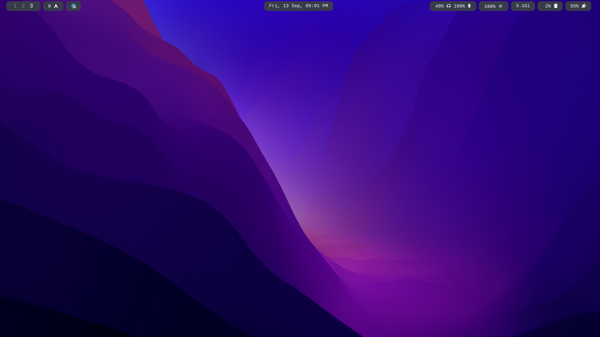

Here's a `README.md` file for your Sway configuration repository. This README covers an introduction, setup instructions, dependencies, usage, and more. Feel free to adjust it according to your specific needs and add any additional details you think are important.

---

## Sway Configuration

This repository contains my personal configuration files for the [Sway](https://swaywm.org/) window manager on Arch Linux. The configuration includes settings for Waybar, wallpapers, scripts, and custom keybindings to provide a clean, efficient, and productive tiling window management experience.

### Table of Contents

1. [Features](#features)
2. [Dependencies](#dependencies)
3. [Installation](#installation)
4. [Usage](#usage)
5. [Keybindings](#keybindings)
6. [Custom Scripts](#custom-scripts)
7. [Screenshots](#screenshots)
8. [Contributing](#contributing)
9. [License](#license)

### Features

- Custom Sway configuration for tiling and floating windows.
- Waybar configuration for a customizable status bar.
- Keybindings for easy navigation and system control.
- Scripts for screenshots, workspace management, and more.
- SDDM theme customization.

### Dependencies

Ensure you have the following packages installed before setting up the configuration:

- **Sway**: The window manager.
- **Waybar**: A customizable status bar for Wayland.
- **Grim**: A screenshot tool for Wayland.
- **Slurp**: A tool to select regions on Wayland.
- **wl-clipboard**: Clipboard utility for Wayland.
- **SDDM**: A display manager (with the astronaut theme).

You can install all dependencies using `pacman`:

```bash
sudo pacman -S sway waybar grim wl-clipboard slurp sddm
```

### Installation

To set up this Sway configuration, follow these steps:

1. **Clone the repository:**

   ```bash
   git clone https://github.com/Vedant9500/sway_config.git
   cd sway_config
   ```

2. **Run the setup script:**

   A script is provided to automate the installation and setup process. Run the following command:

   ```bash
   ./setup_environment.sh
   ```

   This script will:

   - Install necessary packages.
   - Move configuration files to their appropriate locations.
   - Set up Waybar, wallpapers, and scripts.
   - Install and set up the SDDM astronaut theme.

3. **Enable SDDM (if not already enabled):**

   ```bash
   sudo systemctl enable sddm
   ```

### Usage

After installing, restart your system or log out and log back in. Sway should start with the configured setup.

- **Keybindings**: Use `$mod` (usually the `Super` key) along with other keys to navigate, launch applications, and manage windows.
- **Waybar**: The top bar will display information such as workspaces, system stats, date/time, etc.
- **Custom Scripts**: Scripts provided in the repository can be used for various tasks like taking screenshots, changing wallpapers, and more.

### Keybindings

Here are some of the keybindings included in this configuration:

- `$mod + T `: Open terminal
- `$mod + A`: Application launcher
- `$mod + alt + R`: System restart 
- `$mod + alt + Q`: System Shutdown
- `$mod + alt + W`: Logout Sway
- `$mod + P`: Screenshot tools
- `$mod + [1-9]`: Switch to workspace

For a complete list of keybindings, refer to the `config` file.

### Custom Scripts

The `scripts` directory contains several useful scripts:

- **`screenshot_clipboard.sh`**: Takes a screenshot and copies it to the clipboard.
- **`screenshot_region_clipboard.sh`**: Select a region to screenshot and copy to the clipboard.
- **`wlogout` and `swaylock` integration**: Scripts to handle session management and locking.

Make sure to make the scripts executable:

```bash
chmod +x ~/scripts/screenshot_clipboard.sh
chmod +x ~/scripts/screenshot_region_clipboard.sh
```

### Screenshots


### Contributing

Feel free to fork this repository and make your own changes. Pull requests are welcome for any improvements or additional features.

### License

This repository is licensed under the MIT License. See the [LICENSE](./LICENSE) file for more information.

---
